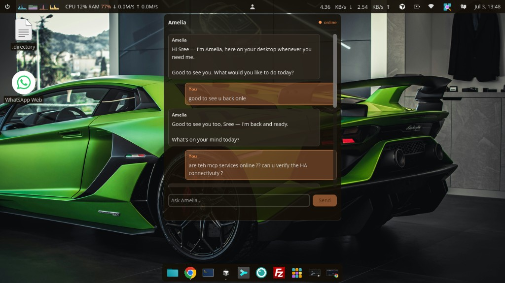

# Amelia widget

A local desktop assistant for Linux — embedded in your desktop shell, not another app window.

Amelia pairs a **Node.js backend** (powered by the [Cursor SDK](https://www.npmjs.com/package/@cursor/sdk) and MCP tools) with native chat frontends for **KDE Plasma**, **COSMIC**, and **GNOME**. Install the server once, pick the UI for your desktop, and talk to your agent from the panel.



*Amelia on Pop!_OS / COSMIC — live status, message bubbles, and streaming chat.*

## Why this exists

Projects like [OpenClaw](https://github.com/openclaw/openclaw) and Hermes showed what custom agentic assistants can feel like — always available, tool-connected, and shaped around your workflow. The question that started Amelia was simpler:

> If you already pay for a **Cursor subscription** with access to multiple models, can that be turned into your own agent system instead of living only inside the IDE?

Cursor ships an official **SDK** (`@cursor/sdk`). This repo is what came out of experimenting with it: a small local API, a persistent agent session, MCP integrations (Home Assistant, memory, fetch, and anything you wire up), and desktop widgets so the assistant lives **in the OS** — panel icon, popup chat, systemd service — rather than as a separate application you alt-tab to.

Amelia is early and personal, but the shape is deliberate: **leverage what you already have, keep it local, make it native.**

### Roadmap

- More desktop platforms and shell integrations
- Richer tool / MCP workflows
- Deeper OS hooks (quick actions, voice — TBD)

**Want in?** Fork it, clone it, make it yours. Explore the code, open issues, send PRs — contributions welcome.

## Choose your desktop UI

| Desktop | Frontend | Install |
|---------|----------|---------|
| **KDE Plasma** (Kubuntu, KDE Neon, etc.) | QML plasmoid (`package/`) | `./install.sh` |
| **COSMIC** (Pop!_OS 24.04+, COSMIC on Ubuntu) | Rust panel applet (`cosmic-applet/`) | `cd cosmic-applet && ./install.sh` |
| **GNOME** (Ubuntu 24.04+, Fedora 39+) | Shell extension (`gnome-extension/`) | `cd gnome-extension && ./install.sh` |

**GNOME Shell 45+** is required for the extension. Ubuntu 22.04 (GNOME 42–43) is not supported without a legacy port.

All frontends share one backend at `http://127.0.0.1:8787`.

## Layout

```text
amelia-widget/
  server/           # Node API + Cursor SDK agent (required for all UIs)
  package/          # KDE Plasma plasmoid (QML)
  cosmic-applet/    # COSMIC panel applet (Rust + libcosmic)
  gnome-extension/  # GNOME Shell extension (GJS)
  install.sh        # Install KDE plasmoid only
```

## Dependencies

Everything below is **Linux**. You need the **backend** plus **one** desktop frontend for your session.

### Accounts & secrets

| Requirement | Notes |
|-------------|--------|
| **Cursor subscription** | Amelia uses the [Cursor SDK](https://www.npmjs.com/package/@cursor/sdk) (`@cursor/sdk`) — an active Cursor account and API key |
| **`CURSOR_API_KEY`** | Set in `server/.env` (see `server/.env-sample`). Never commit this file |

### Backend (`server/`) — required for all UIs

| Requirement | Version / notes |
|-------------|-----------------|
| **Node.js** | **22.13+** (see `server/.nvmrc` — currently Node 22). [nvm](https://github.com/nvm-sh/nvm) is recommended |
| **npm** | Comes with Node; run `npm install` in `server/` |
| **systemd** | User session (`systemctl --user`) for the recommended service install |
| **Network** | Outbound HTTPS to Cursor APIs; local bind on `127.0.0.1:8787` by default |

**Optional — MCP tools** (set `AMELIA_MCP_ENABLED=1` in `.env`):

| Tool | Used by | Install |
|------|---------|---------|
| **Node** | `memory`, `home-assistant-rest` MCP servers | Bundled via `npm install` in `server/` |
| **[uv](https://github.com/astral-sh/uv)** (`uvx`) | `mcp-server-fetch` in the sample config | `curl -LsSf https://astral.sh/uv/install.sh \| sh` or your distro package |
| **Home Assistant** | `home-assistant-rest` | Running HA instance + long-lived token in `.env` |

**Optional — persona files:** copy `SOUL.sample.md` → `SOUL.md`, `USER.sample.md` → `USER.md`.

### Runtime (all frontends)

| Requirement | Notes |
|-------------|--------|
| **Notification daemon** | freedesktop `org.freedesktop.Notifications` (COSMIC, KDE Plasma, and GNOME all provide one) |
| **Local backend** | `amelia-widget.service` or `npm start` in `server/` |

### KDE Plasma plasmoid (`package/`)

| Requirement | Notes |
|-------------|--------|
| **KDE Plasma** | 5.x or 6.x with QML plasmoid support |
| **Qt WebSockets** | `QtWebSockets` QML module (included with Plasma) |
| **Plasma shell** | Restart after install: `killall plasmashell && kstart5 plasmashell &` |

No extra build step — `./install.sh` copies the plasmoid into `~/.local/share/plasma/plasmoids/`.

### COSMIC panel applet (`cosmic-applet/`)

| Requirement | Notes |
|-------------|--------|
| **COSMIC desktop** | Pop!_OS 24.04+, or COSMIC session on another distro |
| **Rust toolchain** | [rustup](https://rustup.rs): `curl --proto '=https' --tlsv1.2 -sSf https://sh.rustup.rs \| sh` |
| **Build packages (Debian/Ubuntu)** | See below |
| **D-Bus** | For desktop notifications at runtime |

```bash
sudo apt install build-essential pkg-config libxkbcommon-dev libwayland-dev \
  wayland-protocols libdbus-1-dev libasound2-dev libudev-dev libpipewire-0.3-dev libssl-dev
```

Fedora/RHEL equivalents: `gcc`, `pkg-config`, `libxkbcommon-devel`, `wayland-devel`, `wayland-protocols-devel`, `dbus-devel`, `alsa-lib-devel`, `systemd-devel`, `pipewire-devel`, `openssl-devel`.

First install compiles from source (~1–3 min); `cosmic-applet/install.sh` installs the binary to `~/.local/bin/`.

### GNOME Shell extension (`gnome-extension/`)

| Requirement | Notes |
|-------------|--------|
| **GNOME Shell** | **45+** (Ubuntu 24.04+, Fedora 39+, etc.) |
| **User extensions** | Enabled in your distro (Ubuntu: Extensions app / `gnome-shell-extension-manager`) |
| **libsoup 3** | Used via GIO for HTTP/WebSocket (provided by GNOME runtime) |

No compiler needed — `gnome-extension/install.sh` copies JavaScript into `~/.local/share/gnome-shell/extensions/`. Restart GNOME Shell after enabling.

### Quick dependency matrix

| Component | KDE | COSMIC | GNOME |
|-----------|-----|--------|-------|
| Backend (`server/`) | ✅ | ✅ | ✅ |
| Node 22.13+ | ✅ | ✅ | ✅ |
| Cursor API key | ✅ | ✅ | ✅ |
| Plasma | ✅ | — | — |
| COSMIC session | — | ✅ | — |
| GNOME Shell 45+ | — | — | ✅ |
| Rust + build deps | — | ✅ (build only) | — |

## Quick start

**Prerequisites:** see [Dependencies](#dependencies) (Node 22.13+, Cursor API key, plus your desktop frontend’s requirements).

### 1. Backend (all desktops)

**Requires Node.js 22.13+** (`@cursor/sdk`). Use [nvm](https://github.com/nvm-sh/nvm).

```bash
cd server
nvm use
cp .env-sample .env          # set CURSOR_API_KEY (never commit .env)
cp SOUL.sample.md SOUL.md    # optional persona
cp USER.sample.md USER.md    # optional user profile
npm install
```

**Recommended — systemd user service:**

```bash
cd server
./deploy/install-service.sh
systemctl --user status amelia-widget
journalctl --user -u amelia-widget -f
```

Keep running after logout (optional):

```bash
loginctl enable-linger "$USER"
```

Manual dev server (stop if the systemd service is already using port 8787):

```bash
npm start
```

### 2. Frontend

Pick one section below for your desktop environment.

---

## Server API

Default base URL: `http://127.0.0.1:8787` (override with `AMELIA_WS_HOST` / `AMELIA_WS_PORT` in `.env`).

| Endpoint | Method | Purpose |
|----------|--------|---------|
| `/health` | GET | Liveness, warmup state, greeting, MCP status |
| `/chat` | POST | `{"message":"...","id":"..."}` → `{"reply":"..."}` or `{"cancelled":true,"reply":"..."}` |
| `/chat/cancel` | POST | `{"id":"..."}` — stop the in-flight turn for that id |
| `/chat/stream` | POST | SSE stream with `chunk`, `done`, `cancelled`, or `error` events |
| `/` | WebSocket | JSON messages: `chat`, `cancel`, `ping` → streaming `chunk` / `done` / etc. |

### `GET /health` response

```json
{
  "ok": true,
  "version": "0.6.0",
  "warm": true,
  "greeting": "Hi — I'm Amelia…",
  "persona": true,
  "userProfile": true,
  "mcp": { "loaded": true, "servers": ["memory", "home-assistant-rest", "mcp-server-fetch"] }
}
```

Desktop clients poll `/health` every **5 seconds** and show status as:

| Badge | Meaning |
|-------|---------|
| `checking…` | Initial bootstrap |
| `offline` | `/health` unreachable |
| `warming…` | API up, agent not warm yet |
| `online` | `ok` + `warm` |
| `thinking…` | Active chat turn in progress |

### Persona (`SOUL.md` / `USER.md`)

On startup the server loads `SOUL.md` (or `PROFILE.md`) and optional `USER.md`, then runs a warm-up turn so Amelia adopts that voice. Override paths with `AGENT_SOUL_PATH` / `AGENT_USER_PATH` in `.env`.

### MCP tools

Enable MCP in `.env`:

```bash
AMELIA_MCP_ENABLED=1
```

Configure servers in **`server/.cursor/mcp.json`** (same format as Cursor IDE / `cursor-openapi`):

```bash
cd server
cp .cursor/mcp.json.sample .cursor/mcp.json
# edit mcpServers — tokens go in .env, referenced as ${env:VAR_NAME}
systemctl --user restart amelia-widget
```

Notes:

- **`${workspaceFolder}`** → `AMELIA_AGENT_CWD` or `server/` cwd
- **`${env:VAR_NAME}`** → value from `server/.env`
- **`MCP_CONFIG_PATH`** — optional path override
- Bundled examples: `memory`, `home-assistant-rest`, `mcp-server-fetch`
- `GET /health` → `mcp.servers` lists loaded server names

### Environment variables

| Variable | Default | Purpose |
|----------|---------|---------|
| `CURSOR_API_KEY` | — | **Required.** Cursor API key |
| `AMELIA_MCP_ENABLED` | `0` | Set to `1` to load MCP servers |
| `MCP_CONFIG_PATH` | `.cursor/mcp.json` | MCP config file |
| `AMELIA_AGENT_CWD` | `server/` cwd | Agent workspace root |
| `AMELIA_WS_HOST` | `127.0.0.1` | HTTP/WS bind host |
| `AMELIA_WS_PORT` | `8787` | HTTP/WS port |
| `HA_BASE_URL` | — | Home Assistant URL (MCP) |
| `HA_API_ACCESS_TOKEN` | — | HA long-lived token (MCP) |
| `AMELIA_DEBUG` | `0` | Log conversations to stderr + `.amelia-conversations.ndjson` |

See `server/.env-sample` for the full list.

### Debug mode

```bash
# in server/.env
AMELIA_DEBUG=1
AMELIA_DEBUG_STREAM=1
```

---

## KDE Plasma plasmoid

```bash
./install.sh
killall plasmashell && kstart5 plasmashell &
```

Remove and re-add the **Amelia** widget from the desktop or panel. See [Dependencies](#kde-plasma-plasmoid-package) for Plasma requirements.

**Features:** WebSocket streaming (HTTP fallback), Cancel / Resume, immersive fullscreen mode (Esc to exit), status indicator, desktop notifications when unfocused. Current plasmoid version: **0.7.6**.

---

## COSMIC panel applet

For **Pop!_OS 24.04+** and other distros running the COSMIC desktop session. See [Dependencies](#cosmic-panel-applet-cosmic-applet) for Rust and build packages.

### Install

```bash
cd cosmic-applet
./install.sh
```

Add **Amelia** from **COSMIC panel settings → Add applet**.

**Features:** Fixed-size chat popup (480×560), message bubbles, `/health` status polling, WebSocket streaming, systemd auto-start (`amelia-widget.service`), Cancel / Resume, desktop notifications when the popup is closed.

Optional session env vars:

| Variable | Default |
|----------|---------|
| `AMELIA_API_URL` | `http://127.0.0.1:8787` |
| `AMELIA_SYSTEMD_SERVICE` | `amelia-widget.service` |

After reinstalling, close the popup and click the panel icon again (COSMIC caches the running applet process).

---

## GNOME Shell extension

For **Ubuntu GNOME 24.04+**, Fedora 39+, and other distros with **GNOME Shell 45+**. See [Dependencies](#gnome-shell-extension-gnome-extension).

```bash
# Ubuntu — optional helper app
sudo apt install gnome-shell-extension-manager

cd gnome-extension
./install.sh
```

Enable **Amelia** in the Extensions app, then restart GNOME Shell:

- **X11:** Alt+F2 → `r` → Enter
- **Wayland:** log out and back in

**Features:** Top-panel icon, chat popup, `/health` polling, WebSocket streaming (HTTP fallback), systemd auto-start, Cancel / Resume / Retry, desktop notifications when the menu is closed.

Same optional env vars as the COSMIC applet (`AMELIA_API_URL`, `AMELIA_SYSTEMD_SERVICE`).

### Desktop notifications

All frontends use **freedesktop notifications** (requires a running notification daemon, e.g. `cosmic-notifications`, KDE Plasma, or GNOME's service).

| Event | When notified |
|-------|----------------|
| **Chat reply** | Assistant finishes a turn while you are not focused on Amelia |
| **Backend offline** | `/health` starts failing |
| **Backend online** | Recovers from offline or warming |

Focus heuristics per UI:

- **COSMIC:** popup is closed
- **GNOME:** panel menu is closed
- **KDE:** another app is active, plasmoid is collapsed, or chat input is not focused

---

## Security

**Never commit secrets.** The repo `.gitignore` excludes:

- `server/.env` (API keys, HA tokens)
- `server/.cursor/mcp.json` (local MCP wiring)
- `server/SOUL.md`, `server/USER.md` (personal persona)
- `server/.amelia-conversations.ndjson` (chat logs)

Only `server/.env-sample` and `server/.cursor/mcp.json.sample` (placeholders) belong in git.

---

## Uninstall

```bash
systemctl --user disable --now amelia-widget
rm -f ~/.config/systemd/user/amelia-widget.service

# KDE
rm -rf ~/.local/share/plasma/plasmoids/org.amelia.widget

# COSMIC
rm -f ~/.local/bin/cosmic-applet-amelia
rm -f ~/.local/share/applications/com.amelia.CosmicApplet.desktop

# GNOME
rm -rf ~/.local/share/gnome-shell/extensions/amelia-widget@amelia.local
```

---

## Contributing

1. **Fork** the repo and create a branch for your change.
2. Keep secrets out of git — use `server/.env-sample` and `mcp.json.sample` as templates only.
3. Open a **pull request** with a short description of what you changed and why.

Ideas we'd love to see: new desktop targets (XFCE, macOS menu bar, Windows tray), better MCP presets, accessibility, i18n, or tighter desktop integration. If you're building something on top of Amelia, we'd enjoy hearing about it.

**License:** GPL-2.0+ (see plasmoid metadata). Fork freely and make it your own.
